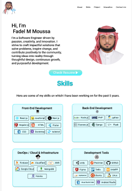
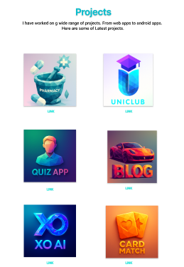
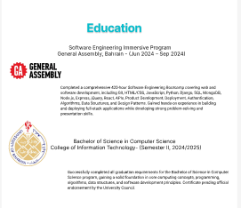
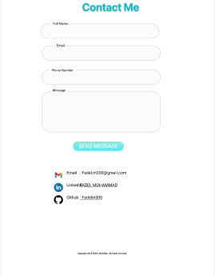

# Fadel  Moussa - Portfolio

## Portfolio
Check out my full portfolio here: [My Portfolio](coming soon🔥😎 )

## About Me
Hi! I'm **Fadel  Moussa**, a Software Engineer driven by passion, creativity, and innovation.  
I strive to craft impactful solutions that solve problems, inspire change, and contribute positively to the community.  

- 🔭 Currently working on web applications and enhancing my DevOps skills  
- 🌱 Always learning new frameworks and technologies  
- 💬 Ask me about React, Node.js, Cloud, and Front-End Development  
- 🎨 Love creating interactive and modern designs  

## Figma Designs
Here are some of my UI/UX designs and prototypes:  

  

 
  
*More designs available on my [Figma Profile](https://www.figma.com/design/hHjbFElldIFWtAuslGfeFu/Untitled?node-id=0-1&m=dev&t=iDzeRe1JNA0fGNpT-1)*

## Connect with Me
- [LinkedIn](www.linkedin.com/in/fadel-mohammad-b70662151)  
- [GitHub](https://github.com/Fadelm300)  
- [Email](Fadel.m200@gmail.com)
